<h1 align="center">GT-Steam-Reborn</h1>

<strong><em>GTNH Steam Age Expansion Mod</em></strong> <strong><em>GTNH 蒸汽时代扩展模组</em></strong>

A GregTech New Horizons expansion mod that **supplements the Steam Age and significantly expands steam usage**, providing 19 multiblock steam machines, 5 single-block nodes, 14 types of hatches, and a Hub-Node binding system. It fills the gameplay gap between the steam age and the electric age in GTNH, making steam a viable and deep progression path rather than a transient phase.

一个 GregTech New Horizons 扩展模组，**补充蒸汽时代并显著拓展蒸汽用途**，提供19台多方块蒸汽机器、5个单方块节点、14种仓室以及枢纽-节点绑定系统。它填补了 GTNH 蒸汽阶段到电力阶段之间的玩法空白，让蒸汽成为一条可行且有深度的进阶路线，而非过渡阶段。

> \[!NOTE]
> This is an unofficial mod. Please avoid discussing this mod in official GTNH forums.
> 这是一个非官方模组，讨论此模组时请注意场合。

> 📖 **完整文档请查阅 [Wiki](https://github.com/MIAOKATZE/GT-Steam-Reborn/wiki) / For full documentation, see the [Wiki](https://github.com/MIAOKATZE/GT-Steam-Reborn/wiki)**

## Downloads & Requirements / 下载与版本需求

| GTNH         | GTSR   | Maintenance / 维护 |
| ------------ | ------ | :--------------: |
| 2.9.0 beta-2 | 1.7.16+ |        ✔️        |
| 2.9.0 beta-1 | 1.7.1+ |        ❌️        |
| 2.8.4        | 1.6.0  |        ❌️        |

***

## Core Mechanic: Mixin Enhancements / 核心机制：Mixin 增强

GTSR injects 9 Mixin classes into GT5U and GT++ to fundamentally enhance the steam machine experience. These are critical to the mod's functionality:

GTSR 向 GT5U 和 GT++ 注入了 9 个 Mixin 类，从根本上增强了蒸汽机器体验。这些是模组功能的关键：

### MTESteamMultiBaseMixin — Steam Multiblock Core Enhancement / 蒸汽多方块核心增强

- **Superheated Steam 4x Speed / 过热蒸汽4倍速**: When any input hatch contains superheated steam, consumption ×4 and processing time ÷4 / 任意输入仓含过热蒸汽时，消耗×4、处理时间÷4
- **Cooling Hatch Support / 冷却仓支持**: Superheated steam → pressure cooling hatch (1:1), normal steam → cooling water (160:1) / 过热蒸汽→耐压冷却仓(1:1)，普通蒸汽→冷却水(160:1)
- **Standard Output Bus Compatibility / 标准输出总线兼容**: Fixes GT5U's `addOutput()` ignoring standard output buses / 修复GT5U的`addOutput()`忽略标准输出总线的问题
- **Dual Steam Type Consumption / 双蒸汽类型消耗**: `depleteInput()` can consume from both normal and superheated steam hatches / 可同时从普通蒸汽和过热蒸汽仓消耗

### Fluid Hatch Compatibility / 流体仓兼容

- **MTEHatchCustomFluidBaseMixin**: Steam-locked fluid hatch accepts ALL steam types (normal/superheated/dense/supercritical); screwdriver auto-input toggle (2000L/tick). / 蒸汽锁定仓接受所有蒸汽类型；螺丝刀自动输入开关（2000L/tick）。
- **MTEHatchInputMixin / MTEHatchInputBusMixin**: 4-state orthogonal toggle (input filter × auto-input) for ALL input hatches/buses via screwdriver right-click. Hatch: 2000L/tick; Bus: 1 stack/5 seconds. Shift+click preserves original mode. / 螺丝刀4状态正交切换（输入过滤×自动输入）。仓：2000L/tick；总线：1组/5秒。Shift+右键保留原模式。

### Steam Bus Behavior / 蒸汽总线行为

- **MTEHatchSteamBusInputMixin / MTEHatchSteamBusOutputMixin**: Enables auto-output for steam input/output buses (previously blocked by GT++). / 启用蒸汽输入/输出总线的自动输出（之前被GT++阻止）。

### Recipe Fix / 配方修正

- **MTERockBreakerRecipeBuilderMixin**: Glowstone dust non-consumable in Rock Breaker's Netherrack recipe (circuit 6). / 荧石粉在岩石破碎机地狱岩配方（电路6）中不可消耗。

### Other Mixins / 其他 Mixin

- **SteamHatchElementOutputBusMixin / CommonMetaTileEntityMixin**: HatchElement extension and unified auto-input scheduling. / HatchElement 扩展与统一自动输入调度。

***

## Hub-Node Binding System / 枢纽-节点绑定系统

The Hub-Node system is GTSR's core innovation, enabling cross-chunk and cross-dimensional fluid transfer and remote operations.

枢纽-节点系统是 GTSR 的核心创新，实现跨区块甚至跨维度的流体传输和远程作业。

### Binding Mechanism / 绑定机制

Hold a node item and right-click a hub controller to bind. Singularity cost varies by node type (steam/water: 0, reinforced steam: 1, overpressure steam: 8, miner/driller: 1). Steam/Water hubs support 3-state cycle: output mode → input mode → unbind. Drilling hub supports 2-state: bind → unbind. Nodes auto-register with their hub on first tick.

手持节点物品右键枢纽控制器绑定。奇点消耗因节点类型而异（蒸汽/水：0，强化蒸汽：1，超压蒸汽：8，采矿/钻井：1）。蒸汽/水枢纽支持3状态循环：输出模式→输入模式→解绑。钻井枢纽支持2状态：绑定→解绑。节点在首次tick时自动向枢纽注册。

### Transfer Mechanism / 传输机制

- **Steam/Water Hub**: Every 20 ticks, transfers fluid between hub and bound nodes at configurable rates. Screwdriver on hub toggles overflow output mode. Transfer rate adjustable via chip right-click (100%→80%→60%→...→1%→0%).
- **Drilling Hub**: Consumes steam to drive active nodes. Miner node outputs → hub Output Bus. Drilling node outputs → hub Output Hatch.
- **蒸汽/水枢纽**：每20tick在枢纽与绑定节点间传输流体，速率可配置。螺丝刀切换溢流输出模式。芯片右键调整传输速率百分比。
- **钻井枢纽**：消耗蒸汽驱动活跃节点。采矿节点产出→枢纽输出总线。钻井节点产出→枢纽输出仓。

***

## Multiblock Machines / 多方块机器 (19)

### Storage Hub Machines / 存储枢纽机器 (2)

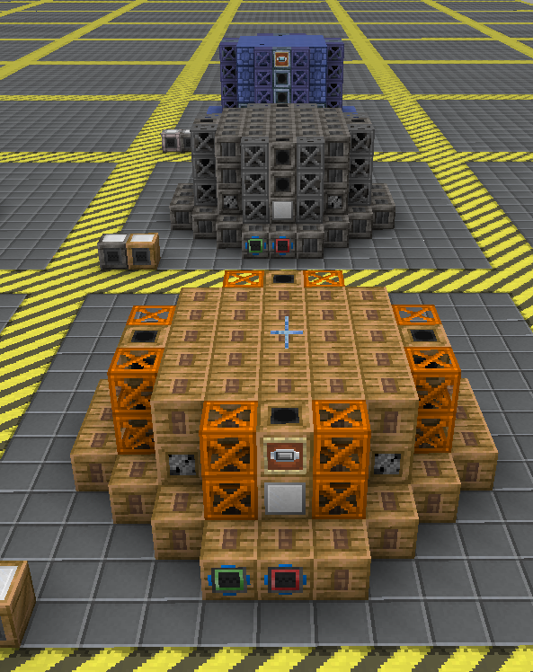 <em>蒸汽枢纽阵列 / Steam Hub Array</em>

**蒸汽枢纽阵列 / Steam Hub Array (SHA)** — 3-tier (Bronze/Steel/TungstenSteel), accepts steam cache nodes, supports normal/dense/supercritical steam, capacity up to 12.8B L with overpressure storage units. Requires Hub Singularity Chip for node binding. Bidirectional transfer (input/output modes). Supports cross-dimensional transfer.

蒸汽枢纽阵列，3级（青铜/钢/钨钢），接受蒸汽缓存节点，支持普通/致密/超临界蒸汽，超压存储单元容量可达12.8B L。需要枢纽奇点芯片绑定节点。双向传输（输入/输出模式）。支持跨维度。

- Tier 1 (Bronze): Bronze casing + pipe + gearbox + frame + Hub Storage Unit (16M L/unit)
- Tier 2 (Steel): Steel casing + pipe + gearbox + frame + Reinforced Hub Storage Unit (64M L/unit)
- Tier 3 (TungstenSteel): TungstenSteel casing + pipe + frame + Overpressure Hub Storage Unit (512M L/unit) + Reinforced Chip enables dense/supercritical steam and ×10 capacity

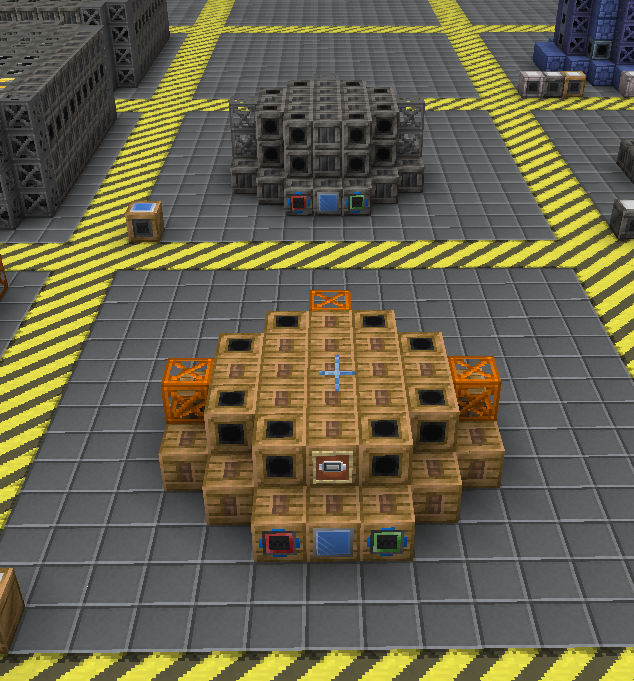 <em>蓄水枢纽阵列 / Water Hub Array</em>

**蓄水枢纽阵列 / Water Hub Array (WHA)** — Bronze/Steel tier, accepts water cache nodes, same-dimension only. Central dispatch for water/distilled water with bidirectional interface.

蓄水枢纽阵列，青铜/钢级，接受水缓存节点，仅同维度。水/蒸馏水的中央调度站，双向接口。

***

### Singularity Drilling Hub / 奇点钻井枢纽 (1)

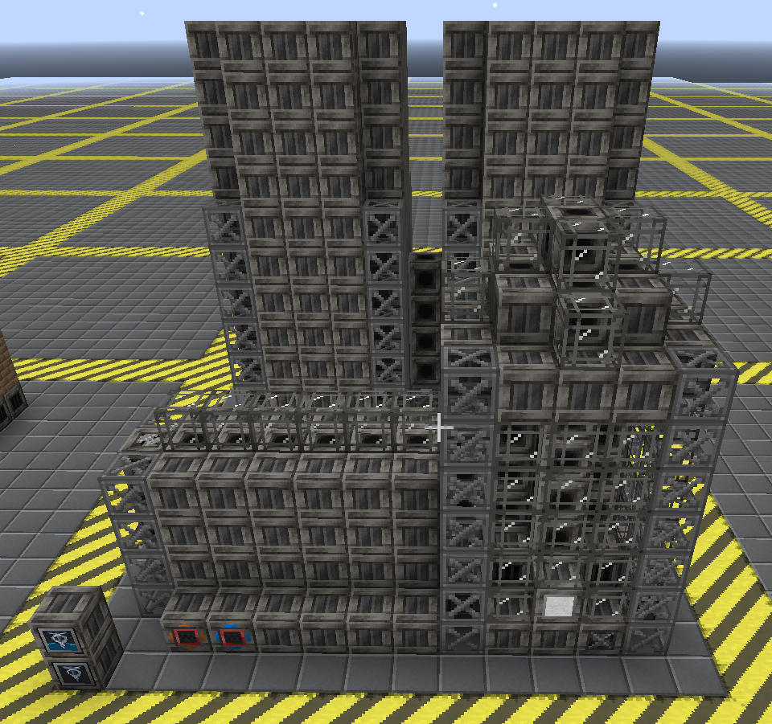 <em>奇点钻井枢纽 / Singularity Drilling Hub</em>

**奇点钻井枢纽 / Singularity Drilling Hub (SDH)** — Steel only, **requires superheated steam (no speed bonus)**, drives drilling and miner nodes. Steam consumption scales with active node count. A marvel of the steam age: based on steam-entangled singularities, creations of the steam age can reach every corner of the world, extracting all needed resources.

奇点钻井枢纽，仅钢级，**必须使用过热蒸汽（无加速效果）**，驱动钻井和采矿节点。蒸汽消耗随活跃节点数增长。蒸汽时代的奇迹造物：基于蒸汽纠缠奇点，蒸汽时代的造物可以遍及世界每一个角落，攫取一切所需的资源。

- Base steam: 2,000 L/s + node costs (2,000\~20,000 L/s per node, only when working)
- Miner node outputs → hub Output Bus; Drilling node outputs → hub Output Hatch
- Requires Hub Singularity Chip for node binding; right-click with node to bind/unbind

***

### Steam Processing Machines / 蒸汽加工机器 (8)

All inherit from `MTESteamMultiBase` (GT++), supporting normal steam and superheated steam 4x speed.

均继承自 `MTESteamMultiBase`（GT++），支持普通蒸汽和过热蒸汽4倍速。

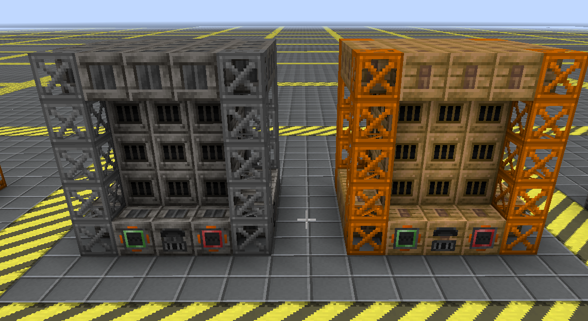 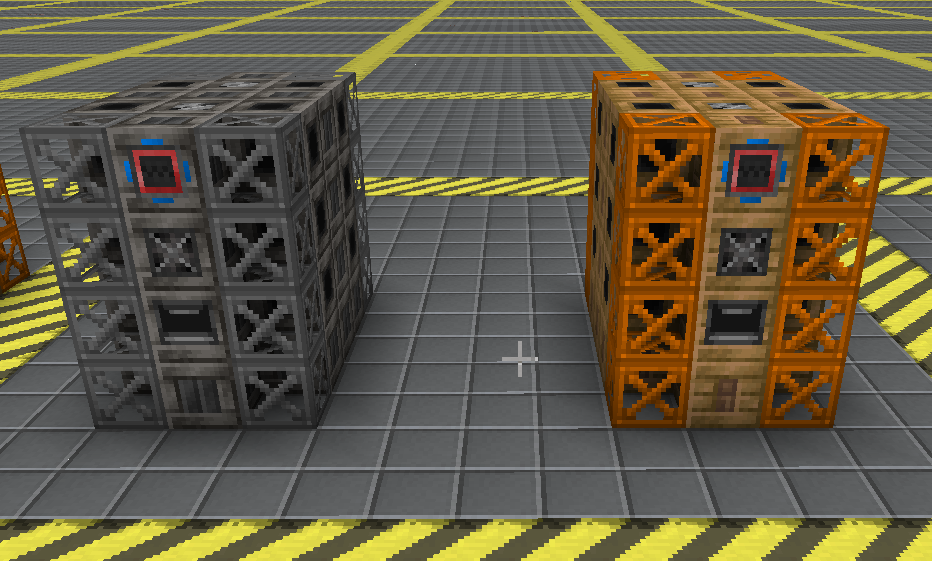 <em>大型蒸汽熔炉 / Large Steam Furnace (left) & 空气压缩机 / Air Compressor (right)</em>

- **大型蒸汽熔炉 / Large Steam Furnace (LSF)**: Bronze/Steel, 24/48 parallel. Steam-driven industrial smelting equipment with greater parallel capacity. Work speed: 250% (Bronze) / 500% (Steel); steam efficiency: 60% / 40%.
  蒸汽驱动的工业化熔炼设备，具有更大的并行数。工作速度250%(青铜)/500%(钢)；蒸汽效率60%/40%。
- **空气压缩机 / Air Compressor (AC)**: Bronze/Steel, 1/4 parallel. Produces air (or nether air in Nether dimension). Far greater speed and convenience than ordinary compressors.
  产出空气（下界维度产出下界空气），远优于普通压缩机的速度和便捷度。

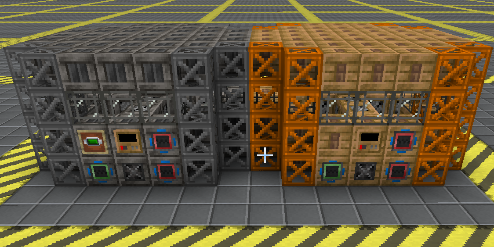 <em>空气离心机 / Atmospheric Centrifuge</em>

- **空气离心机 / Atmospheric Centrifuge (ATC)**: Bronze/Steel, 4/16 parallel. Chip system — basic recipe filters 2 outputs, rare gas chip unlocks up to 8 outputs. Bronze tier cannot install chips.
  芯片系统——基础配方过滤2个输出，稀有气体芯片解锁最多8个输出。青铜级不能安装芯片。

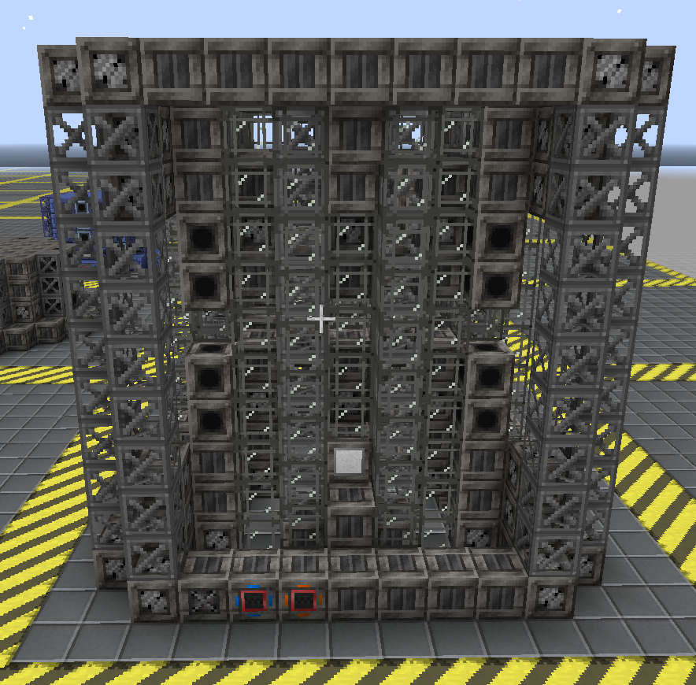 <em>蒸汽奇点压缩机 / Steam Singularity Compressor</em>

- **蒸汽奇点压缩机 / Steam Singularity Compressor (SSC)**: Steel only, heat-based. Accumulates heat to 100% to produce Steam Entangled Singularities. A marvel of the steam age: compressing massive amounts of steam, breaking through spatial limitations, creating cross-dimensional connections. No parallel.
  热量机制，累积热量至100%产出蒸汽纠缠奇点。蒸汽时代的奇迹造物：压缩巨量的蒸汽，突破空间的限制，创造出跨越维度的连接。无并行。

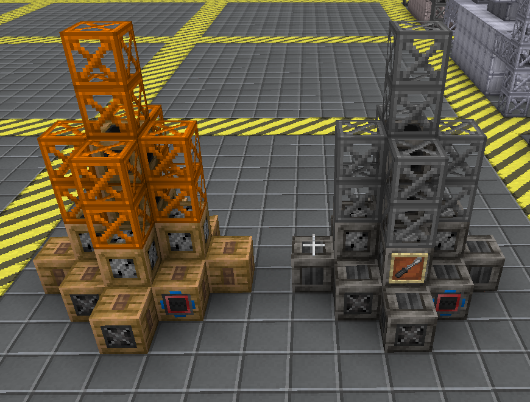 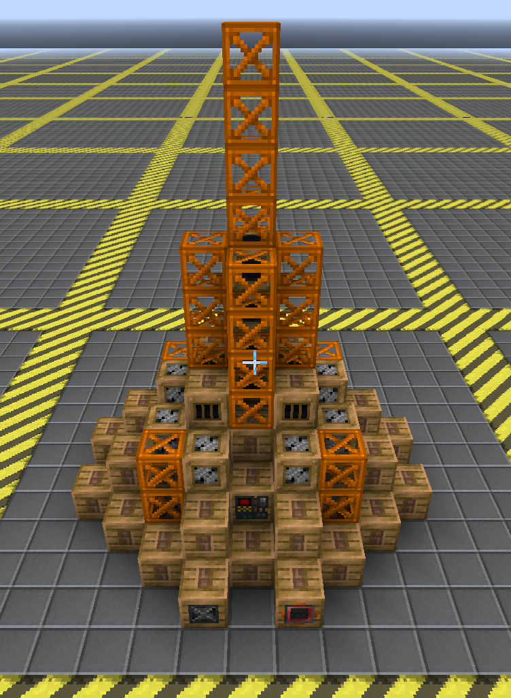 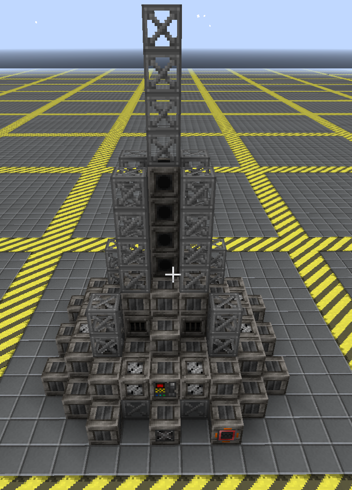 <em>蒸汽流体钻井 / Steam Fluid Drill (left) & 地壳蒸汽掘进机 / Crust Steam Borer (center) & 奇点地壳蒸汽掘进机 / Singularity Crust Steam Borer (right)</em>

- **蒸汽流体钻井 / Steam Fluid Drill (SFD)**: Bronze/Steel. Produces water/distilled water/brine/lava. Screwdriver switches output mode (steel only). Distilled Water 20%, Brine 10%, Lava 0.5% (5% in Nether) efficiency.
  产水/蒸馏水/盐水/岩浆。螺丝刀切换产出模式（仅钢）。蒸馏水20%、盐水10%、岩浆0.5%（下界5%）效率。
- **地壳蒸汽掘进机 / Crust Steam Borer (CSB)**: Bronze/Steel. Void mining — produces ores based on dimension drop tables. Overworld and Nether only.
  虚空采矿——按维度掉落表产出矿石。仅限主世界和下界。
- **奇点地壳蒸汽掘进机 / Singularity Crust Steam Borer (SCSB)**: Steel only. Cross-dimension void mining via GT NEI Ore Plugin dimension display items.
  通过GT NEI Ore Plugin维度显示物品实现跨维度虚空采矿。

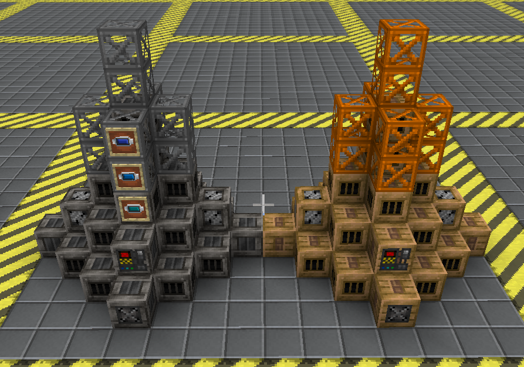 <em>地脉蒸汽热解机 / Vein Steam Pyrolyzer</em>

- **地脉蒸汽热解机 / Vein Steam Pyrolyzer (VSP)**: Bronze/Steel. Reverse-injects steam energy underground to increase underground fluid reserves, solving long-term save fluid depletion. Chip T1/T2/T3 expands scan range (2×2/4×4/8×8 chunks).
  以蒸汽为能源逆向注入地下，增加地下流体储量，解决长期存档中流体枯竭问题。芯片T1/T2/T3扩展扫描范围。

***

### Enhanced Processing Machines / 强化加工机器 (10)

All inherit from `MTEEnhancedMultiBlockBase` (GT5U), with more advanced mechanics.

均继承自 `MTEEnhancedMultiBlockBase`（GT5U），具有更高级的机制。

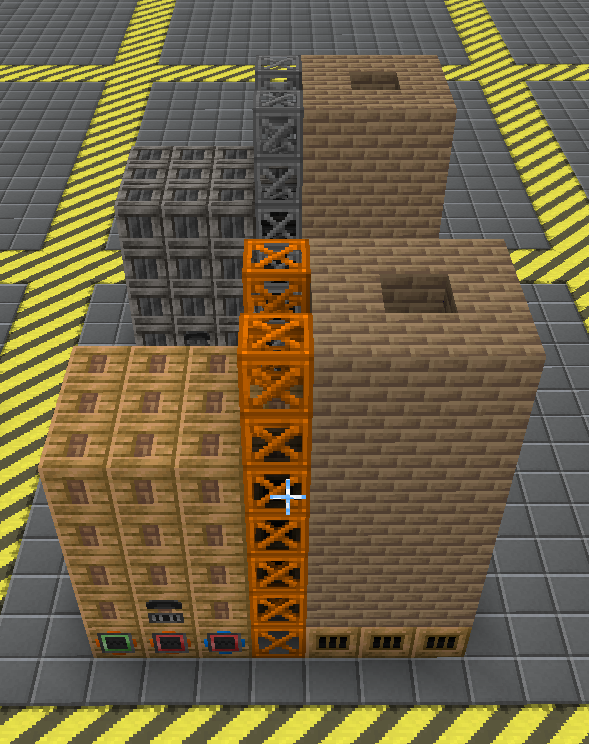 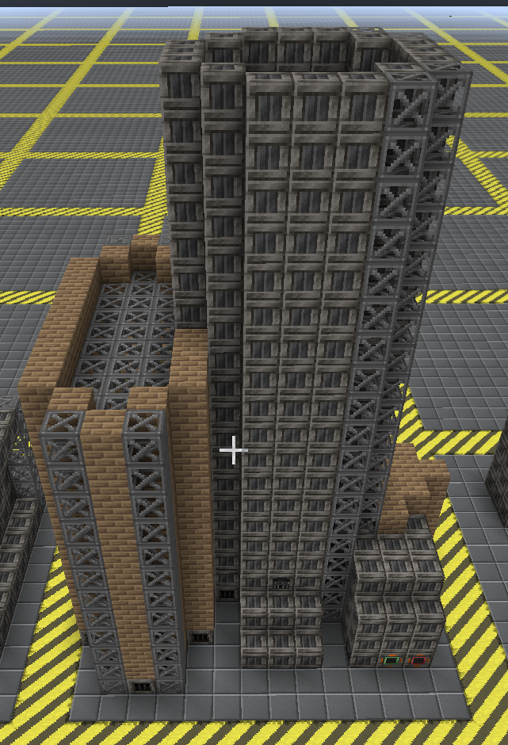 <em>大型焦炉 / Large Coke Oven (left) & 平炉 / Siemens-Martin Furnace (right)</em>

- **大型焦炉 / Large Coke Oven (LCO)**: Bronze/Steel, 8/16 parallel. Self-powered coke oven with temperature acceleration — recipe time decreases as heat increases (minimum 800s). Produces coke from coal.
  无需供能的自发焦炉，温度加速——配方时间随热量增加而缩短（最低800秒）。煤炭→焦炭。
- **平炉 / Siemens-Martin Furnace (SMF)**: Steel only, superheated steam, 64-128 parallel (scales with furnace temperature 100%~200%). Recipe time ×0.75. Consumes 1,000 L/s air during operation (preheat phase exempt; stops if air insufficient). Overheat mechanism: temperature can exceed 100% (max 200%), reducing recipe time by up to 50% (applied after the 0.75 base factor).
  仅钢级，过热蒸汽，64~128并行（随炉温100%~200%线性提升）。配方时间×0.75。运行时消耗1,000 L/s空气（预热阶段不消耗，空气不足时停机）。过热机制：炉温可突破100%（最高200%），配方时间最多削减50%（在0.75基础系数之后应用）。

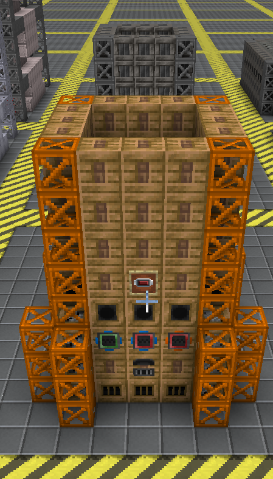 <em>大型地热蒸汽锅炉 / Large Geothermal Steam Boiler</em>

- **大型地热蒸汽锅炉 / Large Geothermal Steam Boiler (LGB)**: Bronze/Steel. Consumes lava to produce steam. Overheat chip (steel only) enables superheated steam output and rare byproduct drops (gold, rutile, scheelite).
  消耗岩浆产蒸汽。过热芯片（仅钢）启用过热蒸汽输出和稀有副产物（金、金红石、白钨矿）。

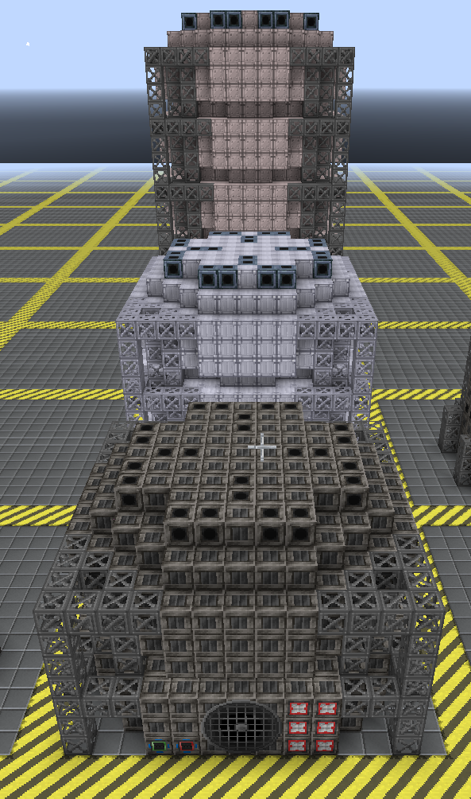 <em>巨型蒸汽轮机机组 / Mega Steam Turbine Array</em>

- **巨型蒸汽轮机机组 / Mega Steam Turbine Array (MSTA)**: 12-tier. Generates EU from steam. Stacking efficiency — more layers = higher efficiency cap. Supports all steam types with progression. Tier 6+ can process dense/supercritical steam.
  蒸汽发电。堆叠效率——层数越多效率上限越高。支持所有蒸汽类型进阶。等级6+可处理致密/超临界蒸汽。

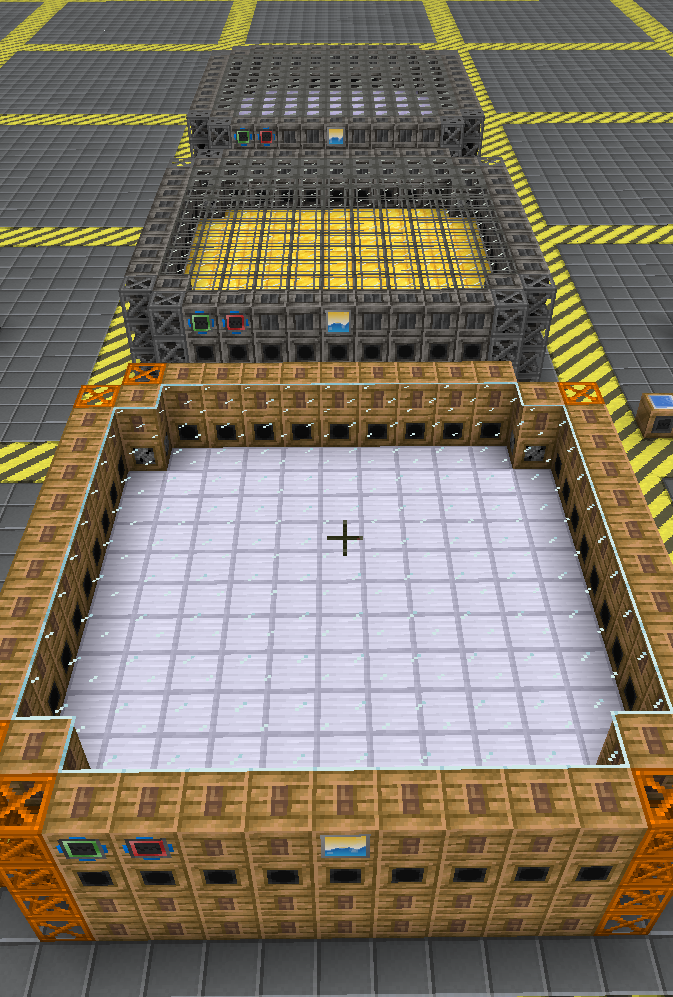 <em>大型太阳能超压阵列 / Large Solar Overpressure Array</em>

- **大型太阳能超压阵列 / Large Solar Overpressure Array (LSOA)**: 3-tier (Bronze/Steel/Nickel). Produces steam from solar energy. Calcification mechanic — efficiency degrades over time. Nether tier produces superheated steam.
  太阳能产蒸汽。钙化机制——效率随时间降低。镍级产出过热蒸汽。

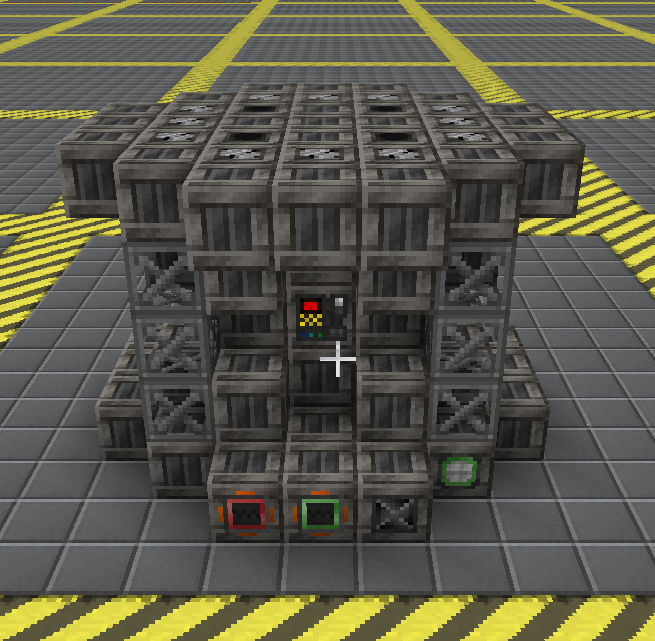 <em>动力加工阵列 / Kinetic Processing Array</em>

- **动力加工阵列 / Kinetic Processing Array (KPA)**: 12-tier, superheated steam only. Dynamic recipes determined by inserted machines. Processes recipes from any single-block machine placed inside. Parallel = (1 + 2 × machineTier) + stackSize. Base speed 200% with 40% energy discount. Pipe casing upgrades speed (Stainless Steel: 250%, Titanium: 300%). Gearbox casing upgrades energy discount (Titanium: 60%).
  仅过热蒸汽。由放入的机器决定配方。处理放入的任意单方块机器的配方。并行数=(1+2×机器等级)+机器数量。基础速度200%，能耗减免40%。管道方块升级速度（不锈钢：250%，钛：300%）。齿轮箱方块升级能耗减免（钛：60%）。

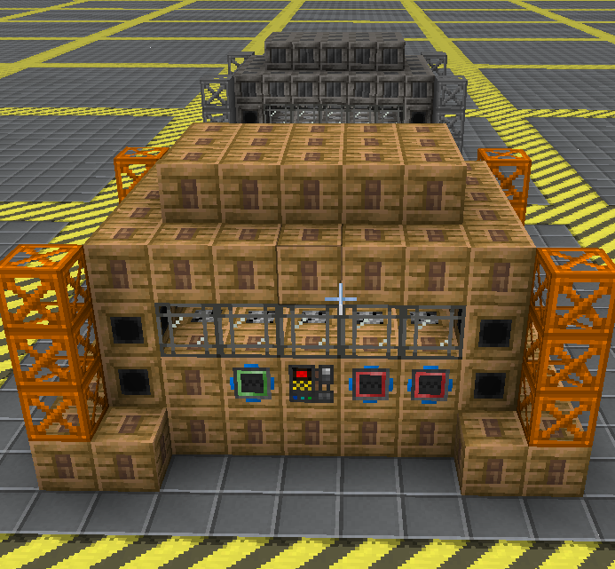 <em>自驱式机械蒸汽压缩机 / Gear Steam Compressor</em>

- **自驱式机械蒸汽压缩机 / Gear Steam Compressor (GSC)**: Bronze/Steel. Converts normal steam → superheated steam + distilled water. Fixed 4:1 compression ratio. Essential for producing superheated steam without electric boilers.
  普通蒸汽→过热蒸汽+蒸馏水。固定4:1压缩比。无需电力锅炉即可产出过热蒸汽的关键机器。

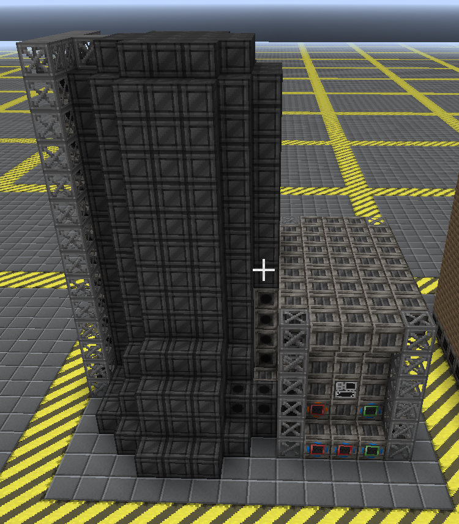 <em>制氨工厂 / Ammonia Plant</em>

- **制氨工厂 / Ammonia Plant (AP)**: Steel only, 64\~256 parallel. Heat-based processing with 7-tier catalyst system (Nickel→Platinum→Uranium→Osmium→FeCo→Ruthenium→Quantum). Higher catalysts = more parallel + faster reaction. Superheated steam as byproduct.
  热量系统+7级催化剂（镍→铂→铀→锇→铁钴→钌→量子）。更高级催化剂=更多并行+更快反应。过热蒸汽为副产物。

***

## Single-Block Nodes / 单方块节点 (5)

### Cache Nodes / 缓存节点 (4)

Digital tank-based nodes that bind to hubs for cross-chunk/dimensional fluid transfer. Support fluid lock, auto-output, void excess, and chip-adjustable hub transfer rate.

基于数字储罐的节点，绑定枢纽实现跨区块/维度流体传输。支持流体锁定、自动输出、溢出虚空和芯片调整枢纽交互速率。

- **蒸汽缓存节点 / Steam Cache Node**: Accepts normal steam only. Binds to Steam Hub.
- **强化蒸汽缓存节点 / Reinforced Steam Cache Node**: Accepts normal + superheated steam. Binds to Steam Hub.
- **超压蒸汽缓存节点 / Overpressure Steam Cache Node**: Accepts ALL steam types. Highest capacity and output rate. Binds to Steam Hub (requires Reinforced Chip on tier 3 hub).
- **水缓存节点 / Water Cache Node**: Accepts water + distilled water. Binds to Water Hub.

### Remote Worker Nodes / 远程工作节点 (2)

Nodes that perform remote operations driven by the Singularity Drilling Hub. They consume mining pipes to drill downward, then extract resources at bedrock level.

由奇点钻井枢纽驱动执行远程作业的节点。消耗钻管向下钻探，到达基岩后提取资源。

- **奇点矿机节点 / Singularity Miner Node**: Mines ores. 4-tier upgrade system using Ore Drill multiblock controllers + singularities. Higher tiers increase mining range, fortune level, and speed. Fortune applies to both normal and small ores.
- **奇点钻井节点 / Singularity Drilling Node**: Extracts underground fluids. 4-tier upgrade system using Oil Drill multiblock controllers + singularities. Higher tiers increase extraction coefficient and work range (1×1 to 8×8 chunks). Each chunk is independently extracted and depleted.

***

## Hatches / 仓室 (14)

Specialized hatches for GTSR machines with varying capacities and fluid filters:

GTSR 机器专用仓室，具有不同容量和流体过滤：

- **蒸汽输入/输出仓 / Steam Input/Output Hatches**: Basic 16K\~128K capacity, steam only
- **蒸汽冷却仓 / Steam Cooling Hatch**: 64K, accumulates cooling water (160 steam : 1 water ratio)
- **耐压蒸汽输入/输出/冷却仓 / Pressure Steam Input/Output/Cooling Hatches**: 512K\~1M capacity, accepts both normal and superheated steam
- **枢纽输入/输出仓 / Hub Input/Output Hatches**: Dynamic capacity (determined by hub controller), delegates fill/drain to hub
- **超压轮机输入仓 / Overpressure Turbine Input Hatch**: For Mega Steam Turbine Array only, accepts all steam types
- **巨型空气输入仓 / Mega Air Input Hatch**: 100M L capacity, accepts air and nether air only. Used by Siemens-Martin Furnace (air consumption) and Atmospheric Centrifuge (large air input).
  1亿L容量，仅接受空气与下界空气。用于平炉（空气消耗）和空气离心机（大量空气输入）。

***

## Items / 物品

- **蒸汽纠缠奇点 / Steam Entangled Singularity**: Core binding material. Produced by Steam Singularity Compressor (heat accumulation). Consumed when binding nodes to hubs and in various crafting recipes.
- **枢纽奇点芯片 / Hub Singularity Chip**: Required for Steam/Water Hub node binding. Also enables hub debug mode when right-clicked.
- **强化枢纽奇点芯片 / Reinforced Hub Singularity Chip**: For tier 3 Steam Hub only — enables dense/supercritical steam, ×10 capacity, and overpressure cache node binding.
- **地热过热芯片 / Geothermal Overheat Chip**: For Large Geothermal Steam Boiler (steel tier) — enables superheated steam output and rare byproducts.
- **稀有气体分离芯片 / Rare Gas Separation Chip**: For Atmospheric Centrifuge — unlocks recipes with >2 fluid outputs (up to 8).
- **矿脉裂解器芯片（T1/T2/T3）/ Vein Pyrolyzer Chip (T1/T2/T3)**: For Vein Steam Pyrolyzer — expands underground fluid scan range.
- **制氨催化剂（7种变体）/ Ammonia Catalyst (7 variants)**: For Ammonia Plant — determines parallel count and reaction time. 7-tier progression from Nickel to Quantum.

***

## Recipes / 配方系统

GTSR adds 9 custom RecipeMaps and extensive crafting recipes:

GTSR 添加了9个自定义 RecipeMap 和大量合成配方：

- **Workbench recipes**: Basic machines (Air Compressor, Atmospheric Centrifuge, etc.), cache nodes, hatches
- **Assembler recipes**: Advanced machines (Ammonia Plant, Singularity Compressor, etc.), chips, catalysts, nodes, overpressure components
- **Custom RecipeMaps**: Large Coke Oven, Siemens-Martin Furnace, Ammonia Plant, Air Compressor, Atmospheric Centrifuge, Steam Singularity Compressor, Geothermal Boiler (NEI display), Steam Fluid Drill (NEI display)
- **工作台配方**：基础机器（空气压缩机、空气离心机等）、缓存节点、仓室
- **组装机配方**：高级机器（制氨工厂、蒸汽奇点压缩机等）、芯片、催化剂、节点、超压组件
- **自定义 RecipeMap**：大型焦炉、平炉、制氨工厂、空气压缩机、空气离心机、蒸汽奇点压缩机、地热锅炉（NEI显示）、蒸汽流体钻井（NEI显示）

***

## Tech Stack / 技术栈

- Java 8 (Jabel) / Minecraft 1.7.10 / Forge 10.13.4.1614
- SpongePowered Mixin (9 mixin classes)
- ModularUI / StructureLib
- Dependencies: GT5U, GT++, Bartworks, EFR, Railcraft, BuildCraft

## License / 许可证

See LICENSE file.
详见 LICENSE 文件。
