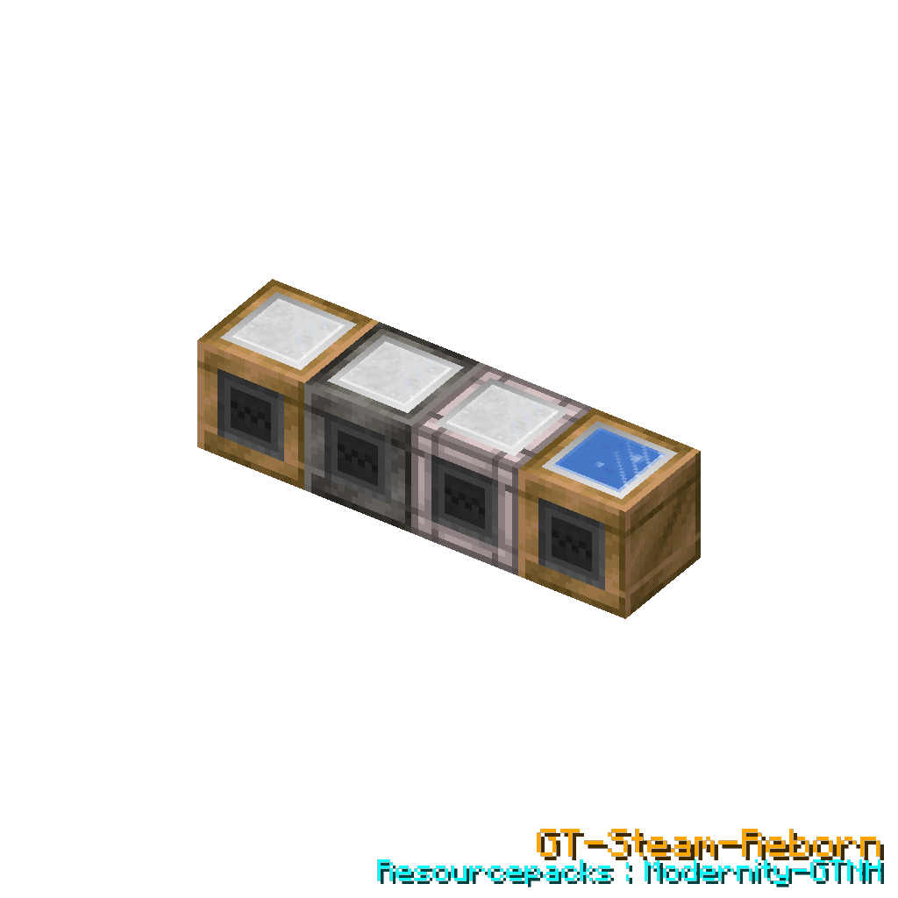

<h1 align="center">GT-Steam-Reborn</h1>

<strong><em>GTNH Steam Age Expansion Mod</em></strong> <strong><em>GTNH 蒸汽时代扩展模组</em></strong>

A GregTech New Horizons expansion mod that **supplements the Steam Age and significantly expands steam usage**, providing 22 multiblock steam machines, 6 single-block nodes, 14 types of hatches plus 3 hub storage units, and a Hub-Node binding system. It fills the gameplay gap between the steam age and the electric age in GTNH, making steam a viable and deep progression path rather than a transient phase.

一个 GregTech New Horizons 扩展模组，**补充蒸汽时代并显著拓展蒸汽用途**，提供22台多方块蒸汽机器、6个单方块节点、14类仓室与3种存储单元以及枢纽-节点绑定系统。它填补了 GTNH 蒸汽阶段到电力阶段之间的玩法空白，让蒸汽成为一条可行且有深度的进阶路线，而非过渡阶段。

> \[!NOTE]
> This is an unofficial mod. Please avoid discussing this mod in official GTNH forums.
> 这是一个非官方模组，讨论此模组时请注意场合。

> 📖 **完整文档请查阅 [Wiki](https://github.com/MIAOKATZE/GT-Steam-Reborn/wiki) / For full documentation, see the [Wiki](https://github.com/MIAOKATZE/GT-Steam-Reborn/wiki)**

## Downloads & Requirements / 下载与版本需求

| GTNH         | GTSR   | Maintenance / 维护 |
| ------------ | ------ | :--------------: |
| 2.9.0 beta-2 | 1.7.16+ |        ✔️        |
| 2.9.0 beta-1 | 1.7.1~1.7.15 |        ✔️        |
| 2.8.4        | 1.6.0  |        ❌️        |

***

## Multiblock Machines / 多方块机器 (22)

### Storage Hub Machines / 存储枢纽机器 (2)

   <em>蒸汽枢纽阵列 / Steam Hub Array（青铜/钢/钨钢）</em>

**蒸汽枢纽阵列 / Steam Hub Array (SHA)** — 3-tier (Bronze/Steel/TungstenSteel) steam storage hub. Accepts steam cache nodes; up to 30 stacked storage layers (320M / 1.28B / 20.48B L per unit); Hub Singularity Chip enables node binding (×5 total capacity), Reinforced Chip (tier 3) enables dense/supercritical steam and ×20 capacity. Bidirectional, cross-dimensional transfer.

蒸汽枢纽阵列，3级（青铜/钢/钨钢）蒸汽存储枢纽。接受蒸汽缓存节点；最多 30 层存储单元（320M / 1.28B / 20.48B L/单元）；枢纽奇点芯片解锁节点绑定（总容量×5），强化芯片（等级3）解锁致密/超临界蒸汽（容量×20）。双向、跨维度传输。

- Tier 1 (Bronze): Bronze casing + pipe + gearbox + frame + Hub Storage Unit (320M L/unit)
- Tier 2 (Steel): Steel casing + pipe + gearbox + frame + Reinforced Hub Storage Unit (1.28B L/unit)
- Tier 3 (TungstenSteel): TungstenSteel casing + pipe + frame + Overpressure Hub Storage Unit (20.48B L/unit) + Reinforced Chip enables dense/supercritical steam and ×20 capacity

  <em>蓄水枢纽阵列 / Water Hub Array（青铜/钢）</em>

**蓄水枢纽阵列 / Water Hub Array (WHA)** — Bronze/Steel tier, accepts water cache nodes, same-dimension only. Central dispatch for water/distilled water with bidirectional interface. Up to 30 stacked storage layers; Hub Singularity Chip multiplies total capacity ×5 (removing it swallows excess water).

蓄水枢纽阵列，青铜/钢级，接受水缓存节点，仅同维度。水/蒸馏水的中央调度站，双向接口。最多叠加30层存储单元；枢纽奇点芯片使总容量×5（取下会吞掉超出部分的水）。

***

### Singularity Drilling Hub / 奇点钻井枢纽 (1)

 <em>奇点钻井枢纽 / Singularity Drilling Hub</em>

**奇点钻井枢纽 / Singularity Drilling Hub (SDH)** — Steel only, **requires superheated steam (no speed bonus)**, drives drilling and miner nodes. Steam consumption scales with active node count. A marvel of the steam age: based on steam-entangled singularities, creations of the steam age can reach every corner of the world, extracting all needed resources.

奇点钻井枢纽，仅钢级，**必须使用过热蒸汽（无加速效果）**，驱动钻井和采矿节点。蒸汽消耗随活跃节点数增长。蒸汽时代的奇迹造物：基于蒸汽纠缠奇点，蒸汽时代的造物可以遍及世界每一个角落，攫取一切所需的资源。

- Base steam: 2,000 L/s + node costs (2,000\~20,000 L/s per node, only when working)
- Miner node outputs → hub Output Bus; Drilling node outputs → hub Output Hatch
- Requires Hub Singularity Chip for node binding; right-click with node to bind/unbind

***

### Steam Processing Machines / 蒸汽加工机器 (7)

All inherit from `MTESteamMultiBase` (GT++), supporting normal steam and superheated steam 4x speed.

均继承自 `MTESteamMultiBase`（GT++），支持普通蒸汽和过热蒸汽4倍速。

  <em>大型蒸汽熔炉 / Large Steam Furnace（青铜/钢）</em>

  <em>空气压缩机 / Air Compressor（青铜/钢）</em>

- **大型蒸汽熔炉 / Large Steam Furnace (LSF)**: Bronze/Steel, 24/48 parallel. Steam-driven industrial smelting equipment with greater parallel capacity. Work speed: 250% (Bronze) / 500% (Steel); steam efficiency: 60% / 40%.
  蒸汽驱动的工业化熔炼设备，具有更大的并行数。工作速度250%(青铜)/500%(钢)；蒸汽效率60%/40%。
- **空气压缩机 / Air Compressor (AC)**: Bronze/Steel, 1/4 parallel. Produces air (or nether air in Nether dimension). Far greater speed and convenience than ordinary compressors.
  产出空气（下界维度产出下界空气），远优于普通压缩机的速度和便捷度。

  <em>空气离心机 / Atmospheric Centrifuge（青铜/钢）</em>

- **空气离心机 / Atmospheric Centrifuge (ATC)**: Bronze/Steel, 4/16 parallel. Chip system — basic recipe filters 2 outputs, rare gas chip unlocks up to 8 outputs. Bronze tier cannot install chips.
  芯片系统——基础配方过滤2个输出，稀有气体芯片解锁最多8个输出。青铜级不能安装芯片。

  <em>蒸汽流体钻井 / Steam Fluid Drill（青铜/钢）</em>

 <em>地壳蒸汽掘进机 / Crust Steam Borer</em>

 <em>地壳物质聚合器 / Crust Matter Aggregator</em>

- **蒸汽流体钻井 / Steam Fluid Drill (SFD)**: Bronze/Steel. Produces water/distilled water/brine/lava. Screwdriver switches output mode (steel only). Distilled Water 20%, Brine 10%, Lava 0.5% (5% in Nether) efficiency.
  产水/蒸馏水/盐水/岩浆。螺丝刀切换产出模式（仅钢）。蒸馏水20%、盐水10%、岩浆0.5%（下界5%）效率。
- **地壳蒸汽掘进机 / Crust Steam Borer (CSB)**: Bronze/Steel. Void mining — produces ores based on dimension drop tables. Overworld and Nether only.
  虚空采矿——按维度掉落表产出矿石。仅限主世界和下界。
- **地壳物质聚合器 / Crust Matter Aggregator (CMA)**: Steel only. Cross-dimension void mining via GT NEI Ore Plugin dimension display items (optional — defaults to the current dimension). Three steam grades at 24,000 L/s (dense fluids 1/100 demand); ore modes (Raw/Crushed/Purified), fortune tiers III~XV with singularity/critical gating, filter & directional modes with steam/UU-Matter cost scaling, and a 200-second singularity mode — all configured via the terminal UI. Full mechanics on the [Wiki](https://github.com/MIAOKATZE/GT-Steam-Reborn/wiki).
  仅钢级，跨维度虚空采矿（GT NEI Ore Plugin 维度显示物品，非必需——缺省当前维度）。三档蒸汽各 24,000 L/s（致密流体 1/100）；矿石模式（原矿/粗矿/粉碎矿）、时运 III~XV（奇点/临界门控）、筛选与定向模式（蒸汽/UU 消耗倍率）、200 秒奇点模式——全部经终端配置界面操作。完整机制见 [Wiki](https://github.com/MIAOKATZE/GT-Steam-Reborn/wiki)。

 <em>地壳物质聚合器终端配置界面 / Crust Matter Aggregator Terminal UI</em>

  <em>地脉蒸汽热解机 / Vein Steam Pyrolyzer（青铜/钢）</em>

- **地脉蒸汽热解机 / Vein Steam Pyrolyzer (VSP)**: Bronze/Steel. Reverse-injects steam energy underground to increase underground fluid reserves, solving long-term save fluid depletion. Chip T1/T2/T3 expands scan range (2×2/4×4/8×8 chunks).
  以蒸汽为能源逆向注入地下，增加地下流体储量，解决长期存档中流体枯竭问题。芯片T1/T2/T3扩展扫描范围。

***

### Enhanced Processing Machines / 强化加工机器 (9)

All inherit from `MTEEnhancedMultiBlockBase` (GT5U), with more advanced mechanics.

均继承自 `MTEEnhancedMultiBlockBase`（GT5U），具有更高级的机制。

  <em>大型焦炉 / Large Coke Oven（青铜/钢）</em>

 <em>平炉 / Siemens-Martin Furnace</em>

- **大型焦炉 / Large Coke Oven (LCO)**: Bronze/Steel, 24/64 parallel. Self-powered coke oven using GT5U vanilla coke oven recipes (coal/lumps/logs/cactus/sugarcane etc.). Base processing speed: Bronze 120% / Steel 200%; heat acceleration: each 1% heat adds 1% work speed (stacked on base speed).
  无需供能的自发焦炉，使用 GT5U 原版焦炉配方（煤炭/煤块/原木/甘蔗/仙人掌等）。基础加工速度：青铜120% / 钢200%；炉温加速：每1%炉温叠加1%工作速度（叠加在基础速度上）。
- **平炉 / Siemens-Martin Furnace (SMF)**: Steel only, superheated steam, 64-128 parallel (scales with furnace temperature 100%~200%). Recipe time ×0.75. Consumes 1,000 L/s air during operation (preheat phase exempt; stops if air insufficient). Overheat mechanism: temperature can exceed 100% (max 200%), reducing recipe time by up to 50% (applied after the 0.75 base factor).
  仅钢级，过热蒸汽，64~128并行（随炉温100%~200%线性提升）。配方时间×0.75。运行时消耗1,000 L/s空气（预热阶段不消耗，空气不足时停机）。过热机制：炉温可突破100%（最高200%），配方时间最多削减50%（在0.75基础系数之后应用）。

  <em>大型地热蒸汽锅炉 / Large Geothermal Steam Boiler（青铜/钢）</em>

- **大型地热蒸汽锅炉 / Large Geothermal Steam Boiler (LGB)**: Bronze/Steel. Consumes lava to produce steam; overheat chip (steel only) enables superheated output and rare byproducts. Calcification: normal water calcifies (distilled water never does); at full calcification output drops to 1%. Overpressure mode (screwdriver right-click, requires 100% heat) raises the heat cap to 200% with linearly growing output; auto-stops when water runs out (manual restart required).
  消耗岩浆产蒸汽；过热芯片（仅钢）启用过热蒸汽输出与稀有副产物。结垢：普通水结垢（蒸馏水永不）；满垢后产出降至 1%。超压模式（螺丝刀开启，需 100% 热量）热量上限提至 200%、产出线性增长；缺水自动停机（需手动重启）。

   <em>巨型蒸汽轮机机组 / Mega Steam Turbine Array（等级 1/3/6）</em>

- **巨型蒸汽轮机机组 / Mega Steam Turbine Array (MSTA)**: 12-tier EU generator. Stacking efficiency — more layers = higher efficiency cap; supports all steam types (tier 6+ processes dense/supercritical). Screwdriver cycles Global Power (100%→80%→60%→40%→20%), trading output for base steam savings. Singularity modes: Entangled ×2 power / Critical ×5 power (plus efficiency & savings bonuses), 200s per singularity. Cycle Overlimit Chip (controller slot, requires all 4 extra stack groups) turns hot-steam cooling into distilled water and stacks steam efficiency within their family.
  12级蒸汽发电机组。堆叠效率——层数越多效率上限越高；支持全蒸汽类型（等级6+可处理致密/超临界）。螺丝刀轮切全局功率（100%→80%→60%→40%→20%），以输出换基础蒸汽节省。奇点模式：纠缠 ×2 功率 / 临界 ×5 功率（含效率与节省加成），每颗 200s。循环超限芯片（控制器槽，需 4 组额外叠加层）使热蒸汽冷却直接产蒸馏水、效率因子按蒸汽家族叠加。

   <em>大型太阳能超压阵列 / Large Solar Overpressure Array（青铜/钢/镍）</em>

- **大型太阳能超压阵列 / Large Solar Overpressure Array (LSOA)**: 3-tier (Bronze/Steel/Nickel). Produces steam from solar energy (base output T1=120K / T2=180K / T3=240K L/s; Nickel tier outputs superheated steam). Solar boiler boost (+2.0x per 64 Advanced, +1.0x per 64 Simple) plus overpressure extra boost — total multiplier up to ×4.0 (max boosted 480K/720K/960K L/s). Calcification and overpressure rules are the same as the Geothermal Boiler (above); auto-stops when water runs out.
  3级（青铜/钢/镍），太阳能产蒸汽（基础产出 T1=120,000 / T2=180,000 / T3=240,000 L/s；镍级产出过热蒸汽）。太阳能锅炉增幅（高级每满组64台+2.0x、简单+1.0x）加超压额外增幅——总倍率最高 ×4.0（最大增幅产出 480K/720K/960K L/s）。结垢与超压规则同地热锅炉（见上）；缺水自动停机。

  <em>动力加工阵列 / Kinetic Processing Array（等级 1/5）</em>

- **动力加工阵列 / Kinetic Processing Array (KPA)**: 12-tier, superheated steam only. Runs recipes of any single-block machine placed inside; parallel = (1 + 2 × machineTier) + stackSize; base speed 200% with 40% energy discount; pipe/gearbox casings upgrade speed and energy discount. Right-click the controller with a Steam Entanglement Node temporarily raises the recipe voltage cap by one tier for 1200s. Built-in Cleanroom, ME crafting bus support, and Electrolyzer/Centrifuge/Chemical Reactor recipe mapping.
  仅过热蒸汽，12级。处理放入的任意单方块机器配方；并行数=(1+2×机器等级)+机器数量；基础速度200%、能耗减免40%；管道/齿轮箱方块升级速度与能耗减免。手持蒸汽纠缠节点右击控制器，临时将配方电压上限提高一级，持续1200秒。内置洁净室、ME 合成总线兼容，并映射电解/离心/化学反应配方。

  <em>自驱式机械蒸汽压缩机 / Gear Steam Compressor（青铜/钢）</em>

- **自驱式机械蒸汽压缩机 / Gear Steam Compressor (GSC)**: Bronze/Steel. Converts normal steam → superheated steam + distilled water. Fixed 4:1 compression ratio. Essential for producing superheated steam without electric boilers.
  普通蒸汽→过热蒸汽+蒸馏水。固定4:1压缩比。无需电力锅炉即可产出过热蒸汽的关键机器。

 <em>制氨工厂 / Ammonia Plant</em>

- **制氨工厂 / Ammonia Plant (AP)**: Steel only, 64\~256 parallel. Heat-based processing with 7-tier catalyst system (Nickel→Platinum→Uranium→Osmium→FeCo→Ruthenium→Quantum). Higher catalysts = more parallel + faster reaction. Superheated steam as byproduct.
  热量系统+7级催化剂（镍→铂→铀→锇→铁钴→钌→量子）。更高级催化剂=更多并行+更快反应。过热蒸汽为副产物。

 <em>加固砖高炉 / Reinforced Brick Blast Furnace</em>

- **加固砖高炉 / Reinforced Brick Blast Furnace (RBBF)**: Single-tier, no steam required. Runs GT5U primitive blast furnace recipes. Furnace temperature rises while working (+0.01%/s), falls when idle (-1%/s). Higher temperature grants more parallels (1-4, each 25% = +1) and faster recipes (up to 1.5x speed). Steel-reinforced brick structure, no maintenance/air/pressure steam required.
  单级，无需蒸汽。执行GT5U原始高炉配方。炉温运行时上升(+0.01%/s)、闲置下降(-1%/s)。温度越高并行越多(1-4，每25%+1)、配方越快(最高1.5倍速)。钢加固砖结构，无需维护/空气/耐压蒸汽。

***

### Singularity Machines / 奇点机器 (3)

All inherit from `MTESingularityMachineBase` (Enhanced system). Without any EU cost, they devour high-grade steam to produce entangled singularities.

三者均继承自 `MTESingularityMachineBase`（Enhanced 体系）。无电力消耗，吞噬高等级蒸汽以产出纠缠奇点。

- **蒸汽奇点纠缠装置 / Steam Singularity Entangler (SSE)**: Devours the highest-grade steam in the input hatches (normal/superheated/supercritical, dense excluded), accumulating heat via a saturation function; at 100% heat it produces 1 Steam Entangled Singularity. No parallel.
  吞噬输入仓中最高等级蒸汽（普通/过热/超临界，不含致密），按饱和函数累积热量；热量 100% 时产出 1 个蒸汽纠缠奇点。无并行。

 <em>蒸汽奇点纠缠装置 / Steam Singularity Entangler</em>

- **临界纠缠奇点稳定装置 / Critical Entangled Singularity Stabilizer (CSC)**: Accepts normal/superheated/supercritical and their dense variants, accumulating heat via a saturation function; at 100% heat it produces 1 Critical Steam Entangled Singularity. Devours all steam from the input hatches and disables steam cooling. Requires an input bus; a gray entanglement animation forms at the structure core while running (visual only).
  接收普通/过热/超临界及其致密蒸汽，按饱和函数累积热量；热量 100% 时产出 1 个临界蒸汽纠缠奇点。会吞噬输入仓全部蒸汽并禁用蒸汽冷却机制。需要输入总线；运行期间结构核心生成灰色纠缠奇点动画（纯视觉）。

 <em>临界纠缠奇点稳定装置 / Critical Entangled Singularity Stabilizer</em>

- **致密态蒸汽操控装置 / Dense State Manipulator (DSM)**: Dual mode cycled by screwdriver: Steam Compression (1000:1 steam → dense) / Steam Decompression (1:1000 dense → steam); each singularity in the input buses fuels 600 seconds. Requires an input bus and an output hatch; no heat mechanic.
  螺丝刀循环切换双模式：蒸汽压缩（1000:1 蒸汽→致密）/ 蒸汽解压（1:1000 致密→蒸汽）；输入总线中每颗奇点燃料续航 600s。需要输入总线与输出仓；无热量机制。

 <em>致密态蒸汽操控装置 / Dense State Manipulator</em>

***

## Single-Block Nodes / 单方块节点 (6)

### Cache Nodes / 缓存节点 (4)

 <em>缓存节点 / Cache Nodes</em>

Digital tank-based nodes that bind to hubs for cross-chunk/dimensional fluid transfer. Support fluid lock, auto-output, void excess, and chip-adjustable hub transfer rate.

基于数字储罐的节点，绑定枢纽实现跨区块/维度流体传输。支持流体锁定、自动输出、溢出虚空和芯片调整枢纽交互速率。

- **蒸汽缓存节点 / Steam Cache Node**: Accepts normal steam only. Binds to Steam Hub.
- **强化蒸汽缓存节点 / Reinforced Steam Cache Node**: Accepts normal + superheated steam. Binds to Steam Hub.
- **超压蒸汽缓存节点 / Overpressure Steam Cache Node**: Accepts ALL steam types. Highest capacity and output rate. Binds to Steam Hub (requires Reinforced Chip on tier 3 hub).
- **水缓存节点 / Water Cache Node**: Accepts water + distilled water. Binds to Water Hub.

### Remote Worker Nodes / 远程工作节点 (2)

 <em>远程工作节点 / Remote Worker Nodes</em>

Nodes that perform remote operations driven by the Singularity Drilling Hub. They consume mining pipes to drill downward, then extract resources at bedrock level.

由奇点钻井枢纽驱动执行远程作业的节点。消耗钻管向下钻探，到达基岩后提取资源。

- **奇点采矿节点 / Singularity Miner Node**: Mines ores. 5-tier upgrade system (Ore Drill controllers + singularities) boosting range, fortune and speed. Crushed-ore mode (screwdriver) outputs at the actual maceration count ×1.5; fortune {6,7,8,9,10} bypasses GT5U's fortune>3 truncation. Binding to a hub enables chunk loading.
  采矿节点：5级升级体系（矿石钻机多方块控制器+奇点）提升采矿范围、时运与速度。粉碎矿模式（螺丝刀）按研磨配方实际数量×1.5 输出；时运 6~10 绕过 GT5U 时运>3 截断。绑定枢纽自动加载区块。
- **奇点钻井节点 / Singularity Drilling Node**: Extracts underground fluids. 4-tier upgrade system using Oil Drill multiblock controllers + singularities. Higher tiers increase extraction coefficient and work range (1×1 to 8×8 chunks). Each chunk is independently extracted and depleted. Binding to a hub enables automatic chunk loading for remote operation.

***

## Hatches / 仓室 (14 类仓室 + 3 种存储单元)

 <em>全部仓室 / All Hatches</em>

Specialized hatches for GTSR machines with varying capacities and fluid filters:

GTSR 机器专用仓室，具有不同容量和流体过滤：

- **蒸汽输入/输出仓（通用）/ Steam Input/Output Hatches (generic)**: Basic 16K\~128K capacity, steam only
- **蒸汽输出仓 / Steam Output Hatch**: Dedicated steam output hatch for GTSR machines
- **蒸汽冷却仓 / Steam Cooling Hatch**: 64K, accumulates cooling water (160 steam : 1 water ratio)
- **耐压蒸汽输入/输出仓 / Pressure Steam Input/Output Hatches**: 512K\~1M capacity, accepts both normal and superheated steam
- **耐压蒸汽冷却仓 / Pressure Steam Cooling Hatch**: Pressure-rated variant of the steam cooling hatch
- **蒸汽枢纽输入/输出仓 / Steam Hub Input/Output Hatches**: Dynamic capacity (determined by hub controller), delegates fill/drain to the Steam Hub
- **蓄水枢纽输入/输出仓 / Water Hub Input/Output Hatches**: Dynamic capacity (determined by hub controller), delegates fill/drain to the Water Hub
- **巨型超压蒸汽输入仓 / Mega Overpressure Steam Input Hatch**: For Mega Steam Turbine Array only, accepts all steam types
- **巨型空气输入仓 / Mega Air Input Hatch**: 100M L capacity, accepts air and nether air only. Used by Siemens-Martin Furnace (air consumption) and Atmospheric Centrifuge (large air input).
  1亿L容量，仅接受空气与下界空气。用于平炉（空气消耗）和空气离心机（大量空气输入）。
- **蒸馏水仓 / Distilled Water Hatch**: 10M L capacity. Harnessing steam-entangled singularities, it condenses the purest water from the void — fills immediately on placement, then refills every 500 ticks. Distilled water never calcifies, making it the ideal working medium for the Solar Array and Geothermal Boiler.
  1000万L容量。借助蒸汽纠缠奇点从虚空中凝结出最为纯净的水源——放置后立即补满，此后每500 tick补满一次。蒸馏水永不结垢，是太阳能阵列与地热锅炉的理想工作介质。
- **枢纽存储单元（3种）/ Hub Storage Units (3)**: 枢纽/加固枢纽/超压枢纽存储单元，用于枢纽阵列层叠（320M / 1.28B / 20.48B L per unit）。 / Hub/Reinforced/Overpressure Hub Storage Units for stacking layers in hub arrays (320M / 1.28B / 20.48B L per unit).

***

## Items / 物品

- **枢纽终端 / Hub Terminal**: Handheld remote management device. Right-click a hub controller to open its status terminal (cache hub / drilling hub); right-click a node to cycle rate, sneak+right-click to toggle mode. Crafted with 1 Steam Entangled Singularity + 8 steel plates. / 手持远程管理设备。右击枢纽控制器打开对应状态终端（缓存枢纽/钻井枢纽）；右击节点循环速率，潜行右击切换模式。1 蒸汽纠缠奇点 + 8 钢板合成。
- **蒸汽纠缠奇点 / Steam Entangled Singularity**: Core binding material. Produced by the Steam Singularity Entangler (heat accumulation). Consumed when binding nodes to hubs and in various crafting recipes.
- **临界蒸汽纠缠奇点 / Critical Steam Entangled Singularity**: Produced by the Critical Entangled Singularity Stabilizer (CSC). Used for more advanced crafting and amplification; legend says it can tear apart the very limits of dimensions... DANGEROUS — it explodes when dropped, never discard it! / 由临界纠缠奇点稳定装置（CSC）产出。用于更高级的合成与增幅；传说其能够彻底撕开维度的限制……危险品——掉落物会爆炸，请勿丢弃！
- **枢纽奇点芯片 / Hub Singularity Chip**: Required for Steam/Water Hub node binding, multiplies hub total capacity ×5. Also enables hub debug mode when right-clicked. Removing it from a filled hub swallows the stored fluid exceeding the reduced capacity.
- **强化枢纽奇点芯片 / Reinforced Hub Singularity Chip**: For tier 3 Steam Hub only — enables dense/supercritical steam, ×20 capacity (replaces the ×5 Hub Chip bonus), and overpressure cache node binding.
- **蒸汽轮机循环超限芯片 / Steam Turbine Cycle Overlimit Chip**: For Mega Steam Turbine Array controller slot — requires all 4 extra stack groups to activate: superheated/supercritical (incl. dense) steam cooling becomes distilled water, and steam efficiency factors stack within their steam family (e.g. supercritical = 超临界+过热+蒸汽 = 2.5×). / 装入巨型蒸汽轮机阵列控制器槽，需完成全部4组额外叠加层：过热/超临界（含致密）蒸汽冷却直接产蒸馏水，蒸汽效率因子按蒸汽家族内叠加（如超临界=超临界+过热+蒸汽=2.5倍）。
- **地热过热芯片 / Geothermal Overheat Chip**: For Large Geothermal Steam Boiler (steel tier) — enables superheated steam output and rare byproducts.
- **稀有气体分离芯片 / Rare Gas Separation Chip**: For Atmospheric Centrifuge — unlocks recipes with >2 fluid outputs (up to 8).
- **矿脉裂解器芯片（T1/T2/T3）/ Vein Pyrolyzer Chip (T1/T2/T3)**: For Vein Steam Pyrolyzer — expands underground fluid scan range.
- **制氨催化剂（7种变体）/ Ammonia Catalyst (7 variants)**: For Ammonia Plant — determines parallel count and reaction time. 7-tier progression from Nickel to Quantum.

> 📷 图片待配：物品栏合成图（10 类物品）

***

## Recipes / 配方系统

GTSR adds 11 custom RecipeMaps and extensive crafting recipes:

GTSR 添加了11个自定义 RecipeMap 和大量合成配方：

- **Workbench recipes**: Basic machines (Air Compressor, Atmospheric Centrifuge, etc.), cache nodes, hatches
- **Assembler recipes**: Advanced machines (Ammonia Plant, Singularity Entangler, etc.), chips, catalysts, nodes, overpressure components
- **Custom RecipeMaps**: Large Coke Oven, Siemens-Martin Furnace, Ammonia Plant, Air Compressor, Atmospheric Centrifuge, Steam Singularity Entangler (NEI display), Geothermal Boiler (NEI display), Steam Fluid Drill (NEI display), Critical Singularity Compressor (NEI display), Dense State Manipulator (NEI display), Gear Steam Compressor (NEI display)
- **工作台配方**：基础机器（空气压缩机、空气离心机等）、缓存节点、仓室
- **组装机配方**：高级机器（制氨工厂、蒸汽奇点纠缠装置等）、芯片、催化剂、节点、超压组件
- **自定义 RecipeMap**：大型焦炉、平炉、制氨工厂、空气压缩机、空气离心机、蒸汽奇点纠缠装置（NEI显示）、地热锅炉（NEI显示）、蒸汽流体钻井（NEI显示）、临界纠缠奇点稳定装置（NEI显示）、致密态蒸汽操控装置（NEI显示）、自驱式机械蒸汽压缩机（NEI显示）

***

## Hub-Node Binding System / 枢纽-节点绑定系统

The Hub-Node system is GTSR's core innovation, enabling cross-chunk and cross-dimensional fluid transfer and remote operations.

枢纽-节点系统是 GTSR 的核心创新，实现跨区块甚至跨维度的流体传输和远程作业。

### Binding Mechanism / 绑定机制

Hold a node item and right-click a hub controller to bind. Singularity cost varies by node type (steam/water: 0, reinforced steam: 1, overpressure steam: 8, miner/driller: 1). Steam/Water hubs support 3-state cycle: output mode → input mode → unbind. Drilling hub supports 2-state: bind → unbind. Nodes auto-register with their hub on first tick.

手持节点物品右键枢纽控制器绑定。奇点消耗因节点类型而异（蒸汽/水：0，强化蒸汽：1，超压蒸汽：8，采矿/钻井：1）。蒸汽/水枢纽支持3状态循环：输出模式→输入模式→解绑。钻井枢纽支持2状态：绑定→解绑。节点在首次tick时自动向枢纽注册。

> 📷 图片待配：节点绑定枢纽的操作示意图或流程截图

### Transfer Mechanism / 传输机制

- **Steam/Water Hub**: Every 20 ticks, transfers fluid between hub and bound nodes at configurable rates. Screwdriver on hub toggles overflow output mode. Transfer rate adjustable via Hub Terminal (100%→80%→60%→...→1%→0%).
- **Drilling Hub**: Consumes steam to drive active nodes. Miner node outputs → hub Output Bus. Drilling node outputs → hub Output Hatch.
- **蒸汽/水枢纽**：每20tick在枢纽与绑定节点间传输流体，速率可配置。螺丝刀切换溢流输出模式。枢纽终端调整传输速率百分比。
- **钻井枢纽**：消耗蒸汽驱动活跃节点。采矿节点产出→枢纽输出总线。钻井节点产出→枢纽输出仓。

### Hub Terminal / 枢纽终端

The Hub Terminal is a handheld remote management device (crafted with 1 Steam Entangled Singularity surrounded by 8 steel plates). Right-click any hub controller with it to open that hub's status terminal — no more running back and forth between nodes.

枢纽终端是手持远程管理设备（1 蒸汽纠缠奇点 + 8 钢板环绕合成）。手持右击任意枢纽控制器即可打开对应的状态终端，告别在节点之间来回奔波。

**Cache Hub Status Terminal (Steam & Water hubs) / 缓存枢纽状态终端（蒸汽与蓄水枢纽通用）**:

 <em>缓存枢纽状态终端 / Cache Hub Status Terminal</em>

使用枢纽终端右击控制器，打开状态GUI。 / Right-click the controller on the hub terminal and open the status GUI.

- Per-node display (icon, custom name, coords + dimension, fluid type, storage/capacity) with 16×16 hover-tooltip buttons: rate cycle / mode toggle (node↔hub) / auto-output; in-place renaming; handheld shortcuts: right-click node to cycle rate, sneak+right-click to toggle mode / 每节点显示（图标、自定义名、坐标+维度、流体类型、储量/容量），16×16 悬浮说明按钮：速率循环 / 模式切换（节点↔枢纽）/ 自动输出；内嵌重命名；手持快捷操作：右击节点循环速率、潜行右击切换模式

**Drilling Hub Status Terminal / 钻井枢纽状态终端**:

 <em>钻井枢纽状态终端 / Drilling Hub Status Terminal</em>

使用枢纽终端右击控制器，打开状态GUI。 / Right-click the controller on the hub terminal and open the status GUI.

- Per-node display (icon, name, tier Mk1-4, status, coords); remote start/stop, quick recycle (needs node stopped/idle, returns mining pipes), in-GUI upgrades, in-place renaming (syncs to WAILA and node GUI) / 每节点显示（图标、名字、等级 Mk1-4、状态、坐标）；远程启停、快捷回收（需节点停止/待机，返还钻管）、UI 内升级、内嵌重命名（同步至 WAILA 与节点 GUI）
- **Phase teleport / 阶段传送**: teleport directly above a bound node (y+1), cross-dimensional; consumes 1 Steam Entangled Singularity from your main inventory only after a safe landing spot is found / 传送到绑定节点正上方（y+1），支持跨维度；仅在找到安全落点后消耗主物品栏 1 个蒸汽纠缠奇点

***

## Core Mechanic: Mixin Enhancements / 核心机制：Mixin 增强

GTSR injects 11 Mixin classes into GT5U and GT++ to fundamentally enhance the steam machine experience. These are critical to the mod's functionality:

GTSR 向 GT5U 和 GT++ 注入了 11 个 Mixin 类，从根本上增强了蒸汽机器体验。这些是模组功能的关键：

### MTESteamMultiBaseMixin — Steam Multiblock Core Enhancement / 蒸汽多方块核心增强

- **Superheated Steam 4x Speed / 过热蒸汽4倍速**: When any input hatch contains superheated steam, consumption ×4 and processing time ÷4 / 任意输入仓含过热蒸汽时，消耗×4、处理时间÷4
- **Cooling Hatch Support / 冷却仓支持**: Superheated steam → pressure cooling hatch (1:1), normal steam → cooling water (160:1) / 过热蒸汽→耐压冷却仓(1:1)，普通蒸汽→冷却水(160:1)
- **Standard Output Bus Compatibility / 标准输出总线兼容**: Fixes GT5U's `addOutputPartial()` ignoring standard output buses / 修复GT5U的`addOutputPartial()`忽略标准输出总线的问题
- **Dual Steam Type Consumption / 双蒸汽类型消耗**: `depleteInput()` can consume from both normal and superheated steam hatches / 可同时从普通蒸汽和过热蒸汽仓消耗

### Fluid Hatch Compatibility / 流体仓兼容

- **MTEHatchCustomFluidBaseMixin**: Steam-locked fluid hatch matches 3 steam types only (normal/superheated/IC2 superheated — dense and supercritical are NOT included); screwdriver auto-input toggle (1000 mB per 100 ticks ≈ 200 L/s). / 蒸汽锁定仓仅匹配 3 种蒸汽（普通/过热/IC2过热，不含致密与超临界）；螺丝刀自动输入开关（1000 mB/100 tick ≈ 200 L/s）。
- **MTEHatchInputMixin / MTEHatchInputBusMixin**: 4-state orthogonal toggle (input filter × auto-input) for ALL input hatches/buses via screwdriver right-click. Hatch: 1000 mB/100 ticks (≈200 L/s); Bus: 1 stack/100 ticks (≈1 stack/5 seconds). Shift+click preserves original mode. / 螺丝刀4状态正交切换（输入过滤×自动输入）。仓：1000 mB/100 tick（≈200 L/s）；总线：1组/100 tick（≈1组/5秒）。Shift+右键保留原模式。

### Steam Bus Behavior / 蒸汽总线行为

- **MTEHatchSteamBusInputMixin / MTEHatchSteamBusOutputMixin**: Steam input buses allow pipe pull from the front container (allowPullStack); steam output buses auto-push to the front container (pushOutputInventory) — both previously blocked by GT++. / 蒸汽输入总线允许正面管道**抽取**（allowPullStack），蒸汽输出总线自动向正面容器**推出**（pushOutputInventory）——两者此前均被GT++阻止。

### Recipe Fix / 配方修正

- **MTERockBreakerRecipeBuilderMixin**: All glowstone dust inputs in Rock Breaker recipes are non-consumable (consumed = false) — no circuit-6 gate. / 岩石破碎机配方中所有荧石粉输入一律不可消耗（consumed=false），无电路6判断。

### Other Mixins / 其他 Mixin

- **SteamHatchElementOutputBusMixin / CommonMetaTileEntityMixin**: HatchElement extension and unified auto-input scheduling. / HatchElement 扩展与统一自动输入调度。
- **BaseMetaTileEntityMixin**: Empty-hand sneak right-click on GTSR steam machines triggers descaling (IShiftRightClickDecalcifiable), canceling the default behavior. / 对 GTSR 蒸汽机器空手潜行右击执行除垢（IShiftRightClickDecalcifiable）并取消默认行为。
- **gtnl/SteamMultiMachineBaseGTNLMixin**: Soft GTNL compatibility — `@Pseudo` + runtime class detection; applies GTSR's full enhancement to GTNL steam machines only when `Config.gtnlEnhancement` is enabled (silent by default). / GTNL 软兼容——`@Pseudo` + 运行时类探测；仅在 `Config.gtnlEnhancement` 开启时对 GTNL 蒸汽机应用 GTSR 完整增强（默认静默）。

***

## Tech Stack / 技术栈

- Java 8 (Jabel) / Minecraft 1.7.10 / Forge 10.13.4.1614
- SpongePowered Mixin (11 mixin classes)
- ModularUI / StructureLib
- Dependencies: GT5U (explicit API dependency), GT++ (visible at compile time via the GT5U fat dev jar, no explicit declaration), Bartworks, TecTech (same fat dev jar), AE2, ModularUI/ModularUI2, GTNHLib, StructureLib, Postea, NEI, IC2, GTNEIOrePlugin, Botania, Waila; EFR (etfuturum) and BuildCraft are soft references (recipes only)

## License / 许可证

See LICENSE file.
详见 LICENSE 文件。
